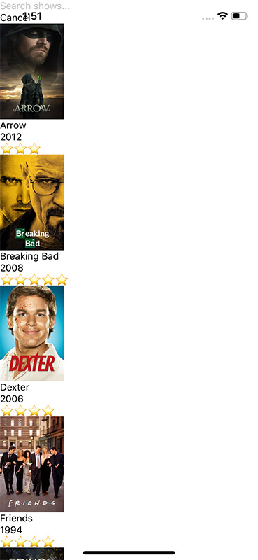
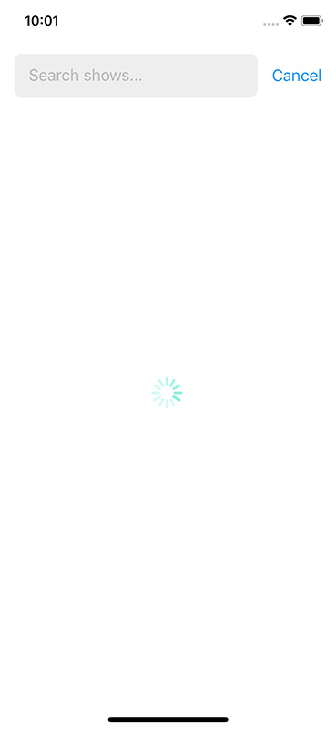
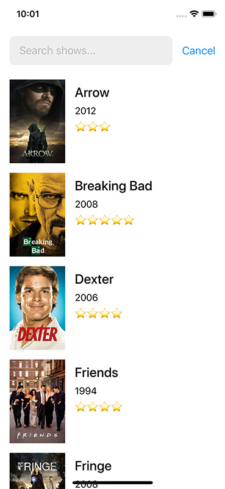
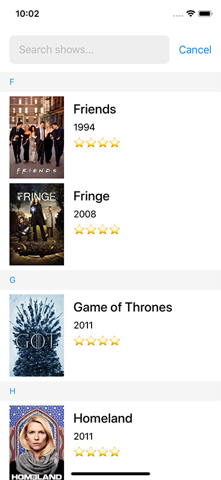
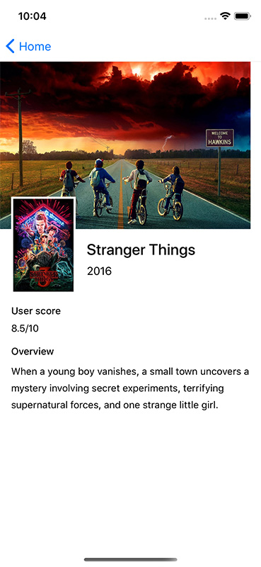
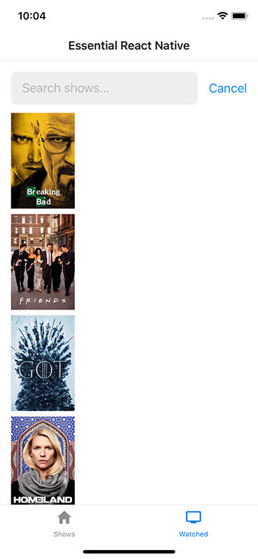
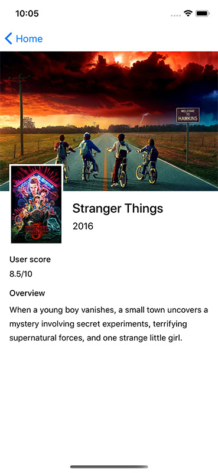
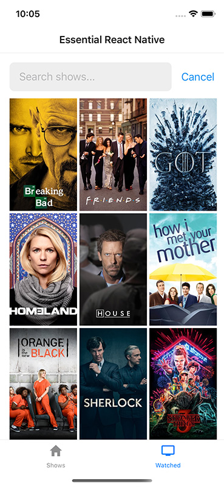

# Essential React Native

### 1. Hello world

* Start a new project using the `expo-cli`.
* Choose "Managed workflow" and "blank".
* Modify the `App.tsx` file to render a "Hello world!". Run it on iOS and Android.
* Set up https://github.com/callstack/eslint-config-callstack.

### 2. Core components

* Create a `src/` directory.
* Our `App.tsx` will simply render the new screen that we will create: `ShowsScreen.tsx`.
* Add a `SearchBar` component which will contain a `TextInput` and a `Cancel` button. 
When cancelling, clear the `TextInput`.
* Create a list using `View`, `Image` and `Text`. Use a simple JS `.map` function.
* For the list, fetch the `/shows` from our server the same way we did on `Intro to React`. 
Use an `ActivityIndicator` when the shows are fetching.
* **Note**: You can reuse hooks from `Deep dive into React` for the search and for the fetch logic.
* **Note**: No scrolling and no styles for now. The only style we are going to use for now is for 
the `Image`. Use it like:
```jsx
<Image
  style={{
   width: 92.6,
   height: 139,
  }}
>
```
* See the design inspiration:



### 3. Styling

* Use `SafeAreaView` and `expo-constants` (from `Constants.statusBarHeight`) to get the correct top 
space in our app. Do it in `App.tsx`.
* Create our own `Touchable` component. On iOS it will use `TouchableOpacity` and on Android it 
will use `Pressable` with ripple effect.
* Style our screen to look like the following design (loading and not loading):

 

### 4. Lists

* For our Shows list, create a `SectionList` with an alphabetic header for each section.
* Let's get rid of `SafeAreaView` and use `expo install react-native-safe-area-context` so the 
scrolling content on the bottom looks nicer.
* Use memoize techniques to make the list performant.
* See the design inspiration:



### 5. Navigation

* Add a `Tab.Navigator` with two tabs: Shows and Watched.
* In the Watched tab, let's use a `FlatList` and not a `SectionList` to render the Shows 
(show only the poster).
* Clicking a Show will open the details page (tabs will not be visible).
* *Note*: Most likely you will need to use `useSafeAreaInsets` less often.
* *Note*: You can use the following constants for image sizes:
```js
export const posterHeight = 139;
export const posterWidth = 92.6;
export const backdropHeight = 240;
export const backdropWidth = 360;
```
* See the design inspiration:

 

### 6. Using native APIs

* When cancelling the search, hide also the keyboard.
* When scrolling the list, if the keyboard is visible, hide also the keyboard.
* In the Watched tab, show posters in a grid of 3 columns using the Dimensions API 
(`useWindowDimensions` hook) and the `numColumns` from `FlatList`.
* Make the cover image in details page to have the width of the device screen using 
the Dimensions API `useWindowDimensions`.

* See the design inspiration:

 

### 7. Data persistence

* Cache data using `AsyncStorage` community package for "Shows" and "Watched", so you do not 
download them everytime.
* *Note*: Try to close the connection with our server to see if it still shows data when reloading 
the app.
